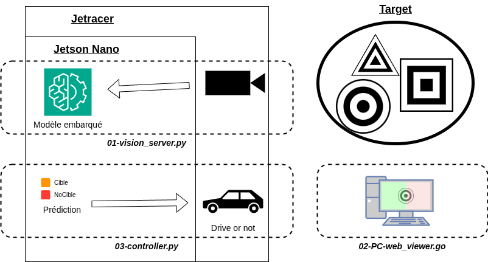

# MSE GPU Robot

This repository contains code and resources for the project of GPU.

This project has 2 use cases: 
1. Go forward and stop when a target is detected.
   
https://github.com/user-attachments/assets/57dd2a84-03d8-436c-acc1-11463ad09c86

2. Follow the target
   
https://github.com/user-attachments/assets/04f3c30a-22f6-43a1-8c0f-2d8a90ea91f9


## Architecture



## Usage

Follow the next steps to set up the project:
1. Create a virtual environment:
```bash
uv venv --python 3.12
source .venv/bin/activate
```

2. Install the required packages:
```bash
uv pip install -r requirements.txt
```
## Training
Copy the data (robot.zip) in the data folder and decompress it. Then run our script:
```bash
cd data
python splitTrainTestVal.py
```
It creates the folders `train/` and `val/` with the corresponding images for the training script `trainCBI.py`.

To train different models there is a bash script `train-model.sh` that produce all necessary files for evaluation and checkpoints. All models are saved in the `models/` folder.
```bash
cd 00-training
./train-model.sh // multi model training
./train-one-model.sh
```

We can vizualize the training process with TensorBoard:
```bash
tensorboard --logdir=./models
```

## Local inference

### Pytorch model

To perform local inference, navigate to the `01-inference/` folder and use the `infer-pytorch.py` script.

You can configure the inference parameters (model name, image path, etc.) at the top of the file:

```python
# =======================
# CONFIGURATION
# =======================
MODEL_NAME = "mobilenet_v2"
IMAGE_PATH = "../data/cible/Image_2025_0005_10_cible.jpg"
NUM_CLASSES = 2
# =======================
```

Then run the script:
```bash
cd 01-inference
python infer-pytorch.py
``` 

### ONNX Model

First, ensure you have the onnx requirements installed:
```bash
uv pip install -r 01-inference/requirements-onnx.txt
```

#### 1. Export PyTorch model to ONNX

Use the export script to convert your trained PyTorch model.
```bash
python 00-training/onnx_export.py --model-dir models/<model_name>
```

#### 2. Validate the ONNX model

Check if the exported model is valid.
```bash
python 00-training/onnx_validate.py models/<model_name>/<model_name>.onnx
```

#### 3. Run Inference

To perform local inference with ONNX, navigate to the `01-inference/` folder and use the `infer-onnx.py` script.

You can configure the inference parameters at the top of the file:

```python
# =======================
# CONFIGURATION
# =======================
MODEL_NAME = "mobilenet_v2"
IMAGE_PATH = "../data/cible/Image_2025_0005_10_cible.jpg"
NUM_CLASSES = 2
# =======================
```

Then run the script:
```bash
cd 01-inference
python infer-onnx.py
```


## Evaluation
There is a jupyter notebook `metrics.ipynb` which produce every plots for batch of training. And there is a possibility to compare every batch training themselves.

You have to place the saved models into a subfolder in `models/` which are the version to setup in the metrics scripts. It works like a filter to select which wave of training do you want to evaluate.

## Jetson inference

The system utilizes a **Micro-services architecture** powered by **ZeroMQ (ZMQ)**. Instead of a single monolithic script, the workload is distributed across three specialized processes using a Publisher-Subscriber pattern.

1.  **Publisher (Jetson)**: The Vision Server. It captures images and performs continuous inference.
2.  **Subscriber A (Jetson)**: The Controller. It listens for detection probabilities and manages the motors.
3.  **Subscriber B (Laptop)**: The Viewer. It listens for video data, renders the overlay, and records to disk.

### Script Descriptions

#### `01-vision_server.py` (Runs on: **Jetson**)
* **Role:** The **Continuous Inference Engine**.
* **Details:** This script is the heavy lifter of the project. Because initializing the CSI camera and loading the PyTorch model into the GPU memory takes significant time and resources, this script is designed to run once and stay alive.
* **Workflow:**
    * It initializes the hardware and loads the neural network weights.
    * It enters a high-performance infinite loop.
    * In every iteration, it captures a frame, preprocesses it, runs the inference, and calculates the **real-time internal FPS**.
    * It broadcasts the results (Target Probability, System FPS, and the compressed image) to the local network via port `5555`.

#### `02-PC-web_viewer.py` (Runs on: **Laptop**)
* **Role:** **Telemetry & Recording**.
* **Details:** Running visualization on the Jetson consumes CPU cycles needed for AI. This script offloads that work to your laptop.
* **Workflow:**
    * It connects to the Jetson over Wi-Fi.
    * It decodes the incoming JPEG stream.
    * It draws the HUD overlay (Target Confidence + Inference FPS) and records the session to an `.avi` file on your laptop's disk.

#### `03-control.py` (Runs on: **Jetson**)
* **Role:** The **Logic Controller**.
* **Details:** This is a lightweight script containing the robot's behavior.
* **Workflow:**
    * It connects to the `vision_server`'s data stream.
    * It receives processed data with near-zero latency.
    * It executes logic (e.g., `if probability > 0.75: stop`).
* **Key Benefit:** Since this script does not hold the model in memory, you can stop, edit, and restart it instantly to tweak parameters (speed, thresholds) without restarting the entire vision pipeline.

### Setup & Usage

#### Step 1: Start the Vision Engine (Jetson)
This process initializes the AI. It takes a moment to warm up.
```bash
# On the Jetson
python3 01-vision_server.py
```
Wait for the message: [System] Inference Loop Started.

#### Step 2 (optionnal): Start the Visualization (Laptop)

Verify the video feed and telemetry before enabling motors.

1. Open web_viewer_pc_final.py and set JETSON_IP = "192.168.1.XX".
2. Run the script:
  ```Bash
  # On the Laptop
  python 02-PC-web_viewer.py
  ```
  Open your browser to http://localhost:5000.

#### Step 3: Activate Control (Jetson)

Once the vision is stable, launch the control logic in a separate terminal.
```bash
# On the Jetson (New Terminal)
python3 control.py
```
